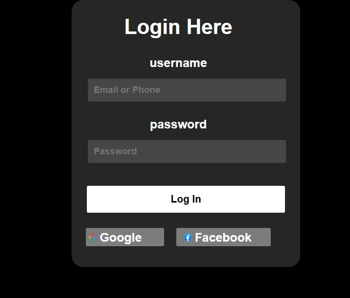

\# Login Page

\## Description

This is a simple Login Page built using HTML and CSS. It provides Login by takes input as Email and Password or with help of Google account or Facebook account in a clean and minimal layout.

\## Preview

\## Live Demo

https://badrinath696.github.io/loginPage/

\## Features

\- Email Login

\- Password

\- Login with

\- Google account or

\- Facebook account

\## Tech Stack

\- HTML

\- CSS

\## What I Learned

\- CSS Flexbox

\- Box model

\- UI spacing

\- Component structuring

\## How to Run

1\. Download or clone the repository

2\. Open index.html in your browser

